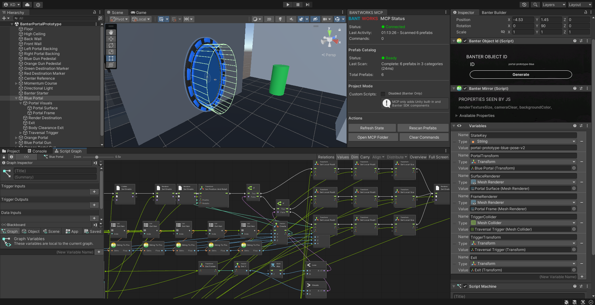
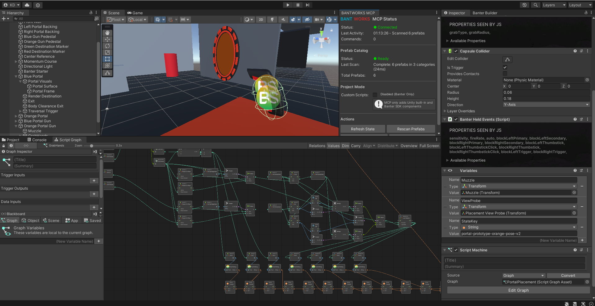
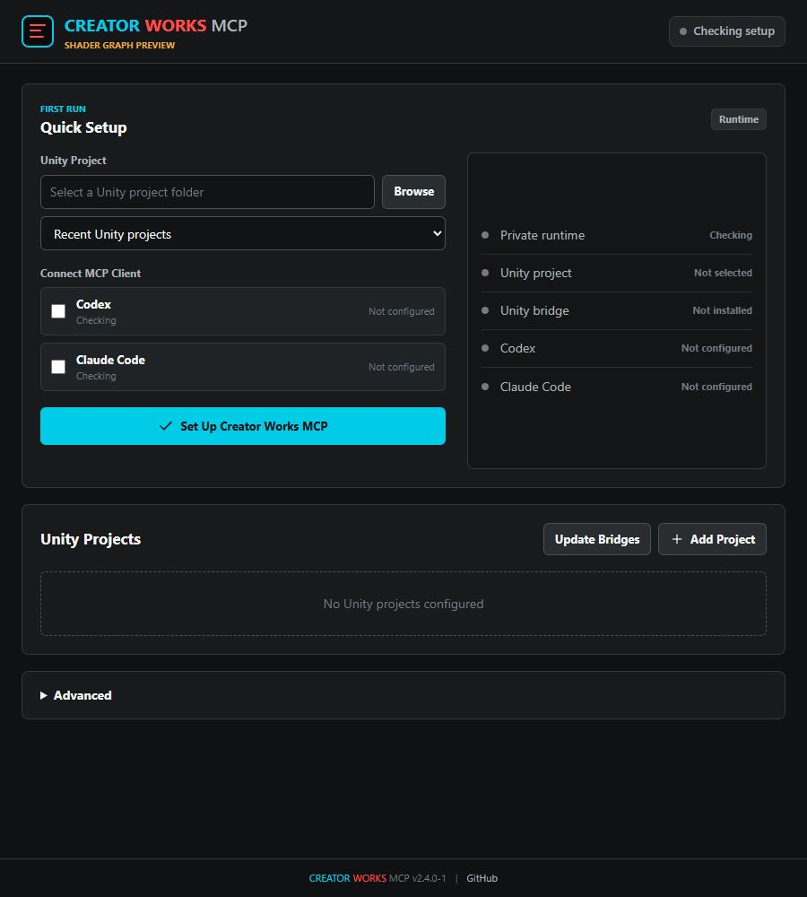

# Creator Works MCP

A Model Context Protocol (MCP) server and Unity Editor bridge for Banter SDK development. It gives Codex, Claude Code, and other compatible MCP clients awareness of a selected Unity project, with tools to create Visual Scripting graphs, WebRoot JavaScript, and more.

> **Shader Graph preview:** Version `2.4.0-1` is an experimental build for Aline. It includes the clean-room Shader Graph authoring branch and is intended for disposable or version-controlled test projects until the remaining compatibility matrix and mutation-safety review are complete.

## Client Compatibility

Creator Works MCP uses the standard stdio MCP transport. Codex is a first-class supported client:

- The Windows launcher can write the selected Unity channel to Codex at `~/.codex/config.toml`.
- `setup.ps1` can configure Codex from its `[X] Apply to Codex` menu action.
- The launcher can keep Claude Code and Codex synchronized when a scene channel changes.
- Other stdio-compatible MCP clients can launch the standalone `creator-works-mcp.mjs` bundle or the source build at `dist/index.js` with the `UNITY_PROJECT_PATH` environment variable.

The AI-facing server identity and generated client entry are `creator-works-mcp` and `creator-works`. Setup removes the former `banter` client entry to avoid duplicate tool servers. Existing Unity bridge filenames, `.bantworks-mcp` project state, named-pipe identifiers, and old launcher environment variables remain supported as compatibility contracts, so integrated projects do not need to be reinjected solely for the rename.

The repository is intentionally generic. Product-specific gameplay and scene logic belong in the Unity project using the bridge. Its only runtime scene logic is a self-contained compatibility fixture that creates a new marked test project and has no dependency on a user's game project or assets.

## Features

- **Banter SDK Knowledge**: 63 source-checked public scene components, one runtime helper, 163 represented Banter Visual Scripting node types, and the BS.* JavaScript API
- **Visual Scripting Authoring**: Create, validate, and safely write native VS graph `.asset` files, including topology-aware grid layout, resolved unit definitions, and required value-port integrity, using the bundled Unity Visual Scripting JSON manual and source-observed errata
- **Experimental Shader Graph Authoring**: Inspect real GraphData nodes/slots/targets, create functional Built-in or URP Lit/Unlit graphs, add and connect nodes with topology-aware layout, and roll back failed imports or shader compilation
- **Banter Validation**: Invoke the selected SDK's own Visual Scripting allow-list validator and return bounded, structured diagnostics
- **Evidence-Linked Banter Workflows**: Execute synced-object, interaction, UI, audio, networking, and WebRoot contracts whose catalogue and tool references are enforced by tests
- **WebRoot JS Generation**: Write JavaScript for built Banter scenes
- **Unity Integration**: Run bounded fresh state queries, persist compiler diagnostics, inspect filtered Console windows, refresh assets, and execute guarded project-defined Editor menu commands
- **Low-Latency Local Bridge**: Prefer versioned project-local named-pipe commands on Windows, with Unity work queued to the main thread and automatic atomic-file compatibility fallback
- **Closed-Loop Workflow**: Validate → Write → Import and deserialize in Unity → Test
- **Capability Profiles**: Limit the exposed tool surface to inspection, authoring, testing, Banter workflows, or minimal project routing
- **Cross-Version Unity Harness**: Provision a deterministic obstacle course that validates physics, serialized scenes, generated Visual Scripting graphs, bridge attachment, Play Mode tests, and optional Banter sync/allow-list behavior

## Banter Visual Scripting Expertise

Creator Works MCP is specifically informed by Banter's Visual Scripting model, not just generic Unity graph syntax:

- **Node catalogue:** 163 unique Banter node types are represented across the bundled references. This includes 162 exact custom node types extracted from a real Banter `AllCustomNodes.asset`, with categories, serialized defaults, sample GUIDs, event metadata, and source hashes.
- **SDK-aware coverage:** `get_banter_sdk_info` reads the selected project's manifest, lock file, git revision or package-cache identity, compares its C# source classes with the embedded catalogues, and matches exact public release and Unity evidence when available. It does not generalize evidence across different source revisions or editor versions.
- **Graph-writing rules:** the bundled Unity Visual Scripting JSON manual v2.2 is preceded by source-observed compatibility errata. Canonical output uses `graph.elements`; referenced nodes use string `$id` values; Visual Scripting 1.9.x may omit `$version` on connections.
- **Generation, validation, and writing:** `generate_vs_graph` resolves captured custom node names and applies their serialized defaults. `validate_vs_graph` accepts current `graph.elements` and older split layouts, checks node-reference integrity, and avoids rejecting valid unreferenced nodes. `write_vs_graph` validates again before writing, emits the ScriptGraphAsset class identifier and `NativeFormatImporter`, and preserves an existing asset GUID while migrating old MCP metadata.
- **Authoritative Editor checks:** `validate_vs_graph_in_unity` forces Unity import and deserialization of one graph, rejects failed unit definitions, and reports every resolved value input that lacks both a valid connection and a persisted default. `validate_banter_visual_scripting` then invokes the installed SDK's public `CheckVsNodes()` validator across graph assets, embedded prefab graphs, and the active scene, returning the SDK's exact allow-list diagnostics.

This knowledge improves graph generation and review, but source-class coverage is not proof of runtime behavior. `validate_vs_graph_in_unity` provides an authoritative import and deserialization check in the selected Editor; generated graphs must still be exercised in the target Unity and Banter SDK version.

## AI-Generated Scene Examples

These Banter prototype screenshots show complete scene work generated through an AI client using Creator Works MCP, including hierarchy construction, configured Banter components, object references, and native Unity Visual Scripting graphs. They are real project examples rather than assets bundled with the MCP.



*Generated portal scene, component setup, graph variables, and portal-state Visual Scripting logic.*



*Generated portal-placement interaction with configured Banter held events, object references, and native Visual Scripting logic.*

## Cross-Version Obstacle Course

`scripts/setup-unity-obstacle-course.ps1` creates or updates only a marked fixture project. It builds moving platforms, rotating hazards, deterministic pivot doors, paired rolling-ball ramps, world-space respawn with motion reset, and optional local asset dressing. When Banter is pinned, it also writes a separate integration scene with two synced balls.

The provisioner generates a plain Unity or Banter event graph through the MCP code, validates its real Unity import through the bridge, attaches it to a `ScriptMachine`, saves and reloads the scene, invokes Banter's validator when available, and runs four Play Mode tests. Optional Asset Store packages remain local and are not committed or required. See [docs/obstacle-course-compatibility.md](docs/obstacle-course-compatibility.md) for the command, safety contract, and exercised matrix.

## Requirements

- Windows 10 or 11 for the guided launcher. The installer includes a private Node.js 24 LTS runtime.
- Node.js 20 or later only when using the standalone ZIP, PowerShell setup, or source checkout.
- A Unity project root containing `Assets`.
- The Banter SDK for Banter-specific components, Visual Scripting nodes, and WebRoot use.
- Unity 6000.3.10f1 is the latest editor version verified with the generic bridge. Experimental Shader Graph authoring is acceptance-tested with Unity 2022.3.39f1/Shader Graph 14.0.11, Unity 6000.1.14f1/Shader Graph 17.1.0, and Unity 6000.3.10f1/Shader Graph 17.3.0; other combinations fail closed unless their required internal API signatures are detected. On Unity 6000.3.2f1, the public Banter SDK 3.2.2 release passes generated graph import, `ScriptMachine.nest.macro` persistence, and SDK allow-list checks; public releases 3.0.2 and 3.1.2 have confirmed Unity 6 material-API compilation failures. Banter 3.1.2 separately passes the obstacle harness on Unity 2022.3.39f1. The bundled Visual Scripting manual is based on Unity 6000.3.2f1; validate generated graphs against the exact Unity and Banter SDK version used by the project.

## Quick Start

### 1. Install Creator Works MCP

Download and run the Windows setup executable from the latest GitHub release. It includes the versioned MCP server, Unity bridge, and a checksum-verified private Node.js runtime; a separate Node.js installation and source checkout are not required.

Verify downloaded artifacts against the release's `SHA256SUMS.txt`. Builds that are not Authenticode-signed can show an **Unknown publisher** or Microsoft Defender SmartScreen warning; a matching checksum verifies file integrity but does not replace publisher identity signing.

Open **Creator Works MCP**, choose a Unity project folder, select the detected MCP clients, and press **Set Up Creator Works MCP**. The launcher installs or updates the bridge, writes the selected client configurations atomically, and reports project, bridge, runtime, Codex, and Claude status in one view. Unity Hub projects are offered automatically when available.

When upgrading from **BANTWORKS MCP**, install and open Creator Works MCP before uninstalling the old application. On first load, the launcher imports the former `%APPDATA%\banter-mcp\launcher-config.json`, including configured Unity projects, the active project, automatic-start, custom-component, and tool-group settings. It replaces legacy server bundle paths and setup removes the former `banter` entries from supported AI-client configurations. Because the rebranded launcher is a separate Windows application, BANTWORKS remains listed in **Installed apps** until it is manually uninstalled. Verify the imported projects and run **Set Up Creator Works MCP** or **Update Bridges** before removing BANTWORKS; project-local `.bantworks-mcp` state and existing Unity content are retained.



*The guided launcher manages the private runtime, MCP client configuration, Unity projects, and project-local bridge updates.*

Bridge copies are project-local. The launcher compares every configured project against its bundled bridge, labels stale copies as **Update available**, and provides **Update Bridges** to back up and refresh all configured projects in one action.

The MSI and standalone ZIP remain available for managed or manual deployments. Tagged releases include `SHA256SUMS.txt` for artifact verification. The standalone ZIP requires Node.js 20 or newer.

From an extracted standalone ZIP, validate the included server with:

```powershell
.\setup.ps1 -Install
```

For development from source:

```powershell
Set-Location <path-to-creator-works-mcp>
npm ci
npm run release:server
```

### 2. Restart the Configured MCP Client

Codex and Claude Code read MCP server configuration at startup. Restart a client that was already open, then ask it to call `get_bridge_status`. A ready bridge reports `ready: true` and `stateStatus: "fresh"`.

The launcher keeps existing multi-project configuration compatible. Selecting an active project can update clients that already have Creator Works MCP configured; it does not create configuration for an unselected client.

### 3. Manual or Standalone Configuration

Both clients launch the same MCP server. Set `UNITY_PROJECT_PATH` to choose the initial project. When launcher channels exist, the server can also list and switch among them without restarting the MCP client.

#### Codex

Add this to `~/.codex/config.toml` (on Windows, normally `C:/Users/<you>/.codex/config.toml`):

```toml
[mcp_servers.creator-works]
command = "node"
args = ["C:/path/to/Creator-Works-MCP/creator-works-mcp.mjs"]
startup_timeout_sec = 20
tool_timeout_sec = 600

[mcp_servers.creator-works.env]
UNITY_PROJECT_PATH = "E:/unity/MCP_base"
CREATOR_WORKS_TOOL_GROUPS = "all"
```

#### Claude Code

```bash
claude mcp add creator-works --scope user -- node C:/path/to/Creator-Works-MCP/creator-works-mcp.mjs
```

Or add the server directly to `.claude.json`:
```json
{
  "mcpServers": {
    "creator-works": {
      "command": "node",
      "args": ["C:/path/to/Creator-Works-MCP/creator-works-mcp.mjs"],
      "env": {
        "UNITY_PROJECT_PATH": "E:/unity/MCP_base",
        "CREATOR_WORKS_TOOL_GROUPS": "all"
      }
    }
  }
}
```

Restart the selected MCP client after changing its configuration.

At runtime, call `list_unity_projects` and pass one of its stable IDs to `select_unity_project`. Selection affects subsequent calls in the current MCP session only; launcher and client configuration remain unchanged.

`setup.ps1` offers the same workflow in PowerShell: use `[X] Apply to Codex` or `[C] Apply to Claude Code` after choosing an active project.

### 4. Manual Unity Bridge Installation

The guided setup installs the bridge automatically. For a manual install, use the PowerShell setup menu or copy the included bridge to your project:
```
<Creator-Works-MCP>/unity-extension/Editor/BanterMCPBridge.cs
  → YourProject/Assets/Editor/BanterMCPBridge.cs
```

Unity will compile it automatically, advertise its protocol and capabilities in `YourProject/.bantworks-mcp/state/project-instance.json`, and start exporting project state.

On Windows, current server and bridge versions prefer a project-local named pipe for small command and acknowledgement messages. Unity API calls are still executed only from `EditorApplication.update` on Unity's main thread. Large state snapshots and correlated artifacts remain atomic project-local files. Legacy bridges, unsupported platforms, stale endpoints, and connection failures automatically use the existing file command channel.

In Edit mode, the bridge keeps a lightweight editor-status heartbeat and debounces full-state exports after actual hierarchy, project, property, undo, scene-open, and scene-save changes. It does not repeatedly traverse an unchanged scene. Automatic full-state export is disabled during Play mode by default to avoid main-thread hierarchy and `SerializedObject` traversal hitches. Command polling and explicit exports remain active during Play mode. Use **Creator Works MCP > Refresh State** or the `export-state` bridge command for an on-demand snapshot, or opt in to periodic Play-mode snapshots with the checkable **Creator Works MCP > Background State Export In Play Mode** menu item. The opt-in is persisted in Unity `EditorPrefs`.

### 5. Verify the Bridge

Ask the MCP client to call `get_bridge_status`. A ready bridge reports `ready: true` and `stateStatus: "fresh"`. If it is not ready, the result contains a specific next step instead of requiring a guess at which part of setup failed.

The Unity Console should also show `[Creator Works MCP] Bridge initialized` after the extension compiles.

## Usage

### Resources (Knowledge available to MCP clients)

| Resource | Description |
|----------|-------------|
| `banter://components` | 63 source-checked public scene components plus the `BanterObjectId` runtime helper |
| `banter://sdk-compatibility` | Catalogue hashes, observed package profiles, and interpretation limits |
| `banter://tool-groups` | Exact capability-group membership, special values, and launcher presets |
| `banter://workflows` | Evidence-linked execution contracts for six focused Banter domains |
| `banter://vs-nodes` | Hand-authored Banter node reference with port notes |
| `banter://custom-vs-nodes` | Exact catalogue of 162 custom Banter node types extracted from a real graph asset |
| `banter://custom-vs-node-log` | Markdown log with every captured custom node, category, and serialized default |
| `banter://js-api` | Complete BS.* JavaScript API |
| `banter://vs-instructions` | How to create Banter Visual Scripting graph files |
| `banter://unity-vs-json-manual` | Unity Visual Scripting JSON manual v2.2 with higher-priority Creator Works compatibility errata |
| `unity://types` | Unity fundamentals (Vector3, Quaternion, etc.) |
| `project://state` | Current scene hierarchy (requires extension) |
| `project://console` | Unity console logs (requires extension) |
| `project://compilation-status` | Persistent Unity compiler result and diagnostics (requires extension) |

### Tools (49 focused actions available to MCP clients)

All 49 tools are exposed by default. Set `CREATOR_WORKS_TOOL_GROUPS` to `read`, `author`, `test`, `banter`, `shadergraph`, a comma-separated union, or `none` for routing/health only. `BANTWORKS_TOOL_GROUPS` remains a fallback for older configurations. Hidden tools are removed from `tools/list` and rejected on direct invocation. See [docs/tool-groups.md](docs/tool-groups.md).

| Category | Tools |
|----------|-------|
| Visual Scripting | `generate_vs_graph`, `validate_vs_graph`, `write_vs_graph`, `validate_vs_graph_in_unity`, `validate_banter_visual_scripting` |
| Banter WebRoot | `write_webroot_js` |
| Project routing | `list_unity_projects`, `select_unity_project` |
| Bridge health and diagnostics | `get_bridge_status`, `query_project_state`, `check_import_status`, `wait_for_unity_compile`, `get_console_logs`, `refresh_unity_assets` |
| Editor control and visual inspection | `control_play_mode`, `capture_unity_screenshot`, `execute_editor_menu_item` |
| Project and asset discovery | `get_unity_packages`, `get_banter_sdk_info`, `search_unity_assets` |
| Unity tests | `discover_unity_tests`, `run_unity_tests`, `cancel_unity_test_run`, `get_unity_test_run` |
| Scene lifecycle and builds | `get_unity_scenes`, `save_unity_scene`, `open_unity_scene`, `set_unity_build_scenes` |
| Scene object operations | `create_gameobject`, `delete_gameobject`, `modify_gameobject`, `get_object_bounds` |
| Components and references | `add_component`, `remove_component`, `set_component_property`, `set_object_reference`, `set_asset_reference` |
| Prefabs and batches | `batch_create`, `instantiate_prefab`, `batch_instantiate_prefabs`, `get_prefab_catalog`, `scan_prefabs` |

Scene-mutating tools run through the Unity bridge and return an explicit Unity acknowledgement when one arrives. Scene state exports stable Unity `globalObjectId` values for GameObjects and components; mutation tools prefer those IDs while retaining path selectors for older clients. Typed inspector writes support scalars, vectors, colors, enums, Rects, and Bounds with explicit validation. Ambiguous or stale selectors fail closed rather than modifying an arbitrary object.

Shader Graph authoring is an experimental, separately scoped capability. Start with `get_shader_graph_capabilities`, inspect an asset to obtain exact node/slot IDs and its `contentHash`, pass that hash into every mutation, then call `validate_shader_graph`. Mutations reject open Shader Graph windows, stale hashes, ambiguous node names, and occupied inputs unless replacement is explicit. See [docs/shader-graph-experiment.md](docs/shader-graph-experiment.md).

Targeted hierarchy reads use a correlated live command when given a `rootPath`, `componentType`, or exact filter. Unity serializes only the requested subtree or matching objects/components, returns world and local transforms, and leaves the full `scene-hierarchy.json` snapshot untouched. Broad hierarchy reads retain the explicit full-snapshot path. Unsupported field projections fail explicitly.

Custom Editor menu results separate proven execution from post-command settling. A long command that returned successfully is not relabelled as failed solely because it temporarily blocked the Editor heartbeat; verified compilation errors still fail the operation.

Batch creation and prefab placement are preflighted and run as one Unity Undo transaction. They roll back on failure by default; partial progress requires the explicit `continueOnError` option.

Unity Test Framework support includes bounded test discovery plus Edit Mode and Play Mode runs filtered by exact names, regex groups, categories, or assemblies. Results survive Play Mode domain reloads, remain queryable by run ID, and distinguish a completed runner operation from failed tests, cancellation, or a zero-test filter. Cancellation uses the public Test Framework API when available (1.6+) and returns an explicit capability error on older packages.

Scene lifecycle tools expose open and build-scene state, save without dialogs, and support Single or Additive loading. Single-mode loads fail closed on dirty scenes unless saving is explicitly requested, and build settings are replaced only after every ordered scene entry passes preflight.

Project routing deduplicates environment and launcher projects by canonical path, assigns stable path-derived IDs, and reports the live Unity editor process identity. Each tool call snapshots its selected project, so switching projects cannot redirect an already-running command.

The complete command transport, identity, and inspector-value contract is documented in [docs/bridge-protocol.md](docs/bridge-protocol.md). The versions exercised in release checks and their known limits are documented in [docs/compatibility.md](docs/compatibility.md). The latest Visual Scripting and desktop integration findings are in [docs/visual-scripting-audit-2026-07-15.md](docs/visual-scripting-audit-2026-07-15.md).

`generate_vs_graph` preserves every explicit node `position`. Nodes without one are arranged left-to-right from graph topology, snapped to a configurable grid, kept near explicitly positioned connected nodes, and separated with estimated or caller-supplied node sizes. Cycles are laid out deterministically. Explicit overlaps are reported rather than silently moving authored nodes.

### Prompts (Guided workflows)

| Prompt | Description |
|--------|-------------|
| `banter_workflow` | Execute one of the six evidence-linked workflow domains |
| `banter_*_workflow` | Focused synced-object, interaction, UI, audio, networking, and WebRoot prompts |
| `create_interactive_object` | Route object creation through the interaction contract |
| `create_vs_graph` | Create a graph with server, Unity import, and SDK validation gates |
| `debug_vs_graph` | Diagnose a graph through the same validation stack |
| `multiplayer_sync` | Classify work as object sync, transient messaging, or persistent state |
| `banter_best_practices` | Apply the source-checked workflow contract |

See [docs/banter-workflows.md](docs/banter-workflows.md) for the workflow and completion gates.

## Example Workflow

```
You: "Create a grabbable ball that changes color when grabbed"

Codex or Claude Code:
1. Uses get_banter_sdk_info to verify the selected SDK source and node coverage
2. Reads banter://components for component info
3. Uses generate_vs_graph to create the logic
4. Uses validate_vs_graph to check for errors
5. Uses write_vs_graph to validate again and save to Unity
6. Uses validate_vs_graph_in_unity to force import and verify deserialization
7. Uses validate_banter_visual_scripting to run the SDK allow-list scan
8. Runs the relevant Unity or Banter behavior test
9. Reports the verified asset path and target SDK identity
```

## Project Structure

```
banter-mcp/
├── src/
│   ├── index.ts              # MCP server entry point
│   ├── lib/
│   │   ├── config.ts         # Project-path configuration
│   │   └── files.ts          # Atomic writes and path containment
│   ├── resources/            # Static knowledge
│   │   ├── banter-components.ts
│   │   ├── banter-custom-vs-nodes.ts
│   │   ├── banter-sdk-compatibility.ts
│   │   ├── banter-vs-nodes.ts
│   │   ├── banter-js-api.ts
│   │   ├── unity-types.ts
│   │   ├── unity-vs-json-manual.ts
│   │   ├── unity-vs-json-errata.ts
│   │   └── vs-graph-instructions.ts
│   ├── tools/                # MCP tools
│   │   ├── validate-vs-graph.ts
│   │   ├── generate-vs-graph.ts
│   │   ├── get-banter-sdk-info.ts
│   │   ├── write-vs-graph.ts
│   │   ├── write-webroot-js.ts
│   │   ├── query-project.ts
│   │   ├── check-import-status.ts
│   │   └── get-bridge-status.ts
│   └── prompts/              # Guided workflows
│       └── index.ts
├── test/                     # Node built-in test suite
├── docs/                     # Audit, protocol, and node reference material
├── compatibility/
│   └── obstacle-course/      # Cross-version Unity integration fixture
├── scripts/
│   └── setup-unity-obstacle-course.ps1
├── unity-extension/
│   └── Editor/
│       └── BanterMCPBridge.cs  # Unity Editor extension
├── package.json
└── tsconfig.json
```

## Transport

This server currently supports stdio transport only. Run the release bundle:

```bash
node creator-works-mcp.mjs
```

From a source checkout, `node dist/index.js` is equivalent after `npm run build`.

The old `--http` flag is intentionally rejected until an HTTP transport is implemented.

## Local AI Support

This MCP follows the standard MCP protocol, so it works with any MCP-compatible client, including:
- Codex (desktop and CLI, via `~/.codex/config.toml`)
- Claude Code (stdio)
- Claude Desktop (stdio)
- Cursor (stdio)
- Any client with MCP support

No local-model host is bundled. Any local LLM client that supports stdio MCP can use the same `node creator-works-mcp.mjs` configuration shown above.

## Troubleshooting

### "UNITY_PROJECT_PATH not set"
Set the environment variable in the MCP client configuration, or configure at least one enabled launcher channel. For a temporary PowerShell session:
```powershell
$env:UNITY_PROJECT_PATH = "E:/unity/MyProject"
```

### "Unity extension not detected"
1. Copy BanterMCPBridge.cs to Assets/Editor/
2. Open Unity and let it compile
3. Check Console for "[Creator Works MCP] Bridge initialized"

### Bridge status is stale
Call `get_bridge_status`. A `stale` state means the bridge exported state previously, but not in the last 10 seconds. Open the selected project in Unity, resolve any Unity compilation errors, and confirm the bridge initialization log.

### VS Graph validation errors
Common fixes:
- Use `Banter.VisualScripting.OnGrab`, not `Banter.VisualScripting.Events.OnGrab`
- Add `coroutine: false` to event nodes
- Generate real GUIDs, not patterns
- Use `InvokeMember` for GetComponent, not a GetComponent node

## Development

```powershell
npm ci
npm test
./scripts/smoke-unity-asset-reference.ps1
./scripts/smoke-unity-banter-vs.ps1
./scripts/smoke-unity-banter-matrix.ps1
./scripts/setup-unity-obstacle-course.ps1 -UnityEditorPath <path-to-Unity.exe> -ProjectPath <fixture-project> -RunTests
cd launcher/src-tauri
cargo check
```

The Banter smoke creates and removes a disposable blank Unity project. It pins
the public SideQuestVR/BanterSDK Git package to a known revision and does not
read or modify a user project. The matrix runs one isolated project per pinned
public release and writes an ignored JSON evidence report under `artifacts/`.
Expected incompatibilities only satisfy the matrix when their exact compiler
diagnostics recur.

The GitHub Actions workflow runs the Node test suite and standalone-bundle smoke on Node 20, 22, and 24, plus the dependency audit and Tauri launcher tests. Version tags build draft NSIS/MSI releases and a standalone ZIP. See [CONTRIBUTING.md](CONTRIBUTING.md) for change requirements, [SECURITY.md](SECURITY.md) for vulnerability reporting, [docs/compatibility.md](docs/compatibility.md) for the verified matrix, and [docs/bridge-protocol.md](docs/bridge-protocol.md) for the local Unity bridge contract.

The evidence-based capability comparison and ordered roadmap are maintained in [docs/unity-mcp-benchmark.md](docs/unity-mcp-benchmark.md).

## License

MIT. See [LICENSE](LICENSE). External research attribution and licensing notes are recorded in [THIRD_PARTY_NOTICES.md](THIRD_PARTY_NOTICES.md).
